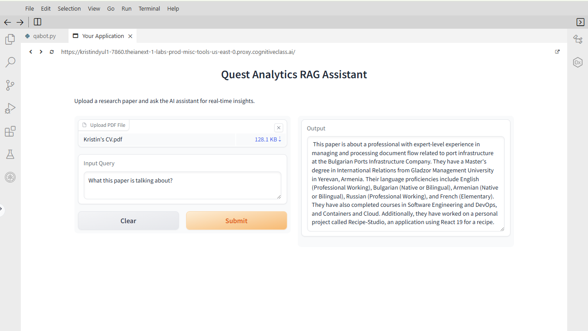

# Quest Analytics RAG Assistant 🚀

A high-precision Retrieval-Augmented Generation (RAG) application built as part of the **IBM Generative AI Certification**. This assistant can "read" any PDF document and provide factual, context-aware answers using a private data pipeline.

## ✨ Key Features
- **Accurate Retrieval:** Uses semantic search to pull data directly from uploaded PDFs.
- **Zero Hallucination:** Optimized to answer only based on the provided document context.
- **Interactive UI:** User-friendly interface built with Gradio.
- **Enterprise-Grade LLM:** Powered by Mixtral-8x7b via IBM Watsonx.ai.

## 🛠️ Tech Stack
- **Orchestration:** [LangChain](https://www.langchain.com/)
- **LLM:** IBM Watsonx.ai (Mixtral-8x7b)
- **Vector Database:** [ChromaDB](https://www.trychroma.com/)
- **Embeddings:** HuggingFace (`all-MiniLM-L6-v2`)
- **Frontend:** Gradio
- **Language:** Python

## 🏗️ How it Works
1. **Document Loading:** PDF files are processed using `PyPDFLoader`.
2. **Chunking:** Text is split into manageable pieces with `RecursiveCharacterTextSplitter` (chunk size: 500, overlap: 50).
3. **Vectorization:** Text chunks are converted into vector embeddings.
4. **Storage:** Embeddings are stored in a ChromaDB vector store for fast similarity search.
5. **RAG Pipeline:** When a question is asked, the system retrieves the most relevant chunks and passes them to the LLM for a grounded answer.

## 📸 Preview 

  

## 🎓 Certification
Developed during the **Mastering Generative AI: RAG and LangChain** course by **IBM & edX**.

* **Official Certificate:** [Verify on edX](https://courses.edx.org/certificates/225bda1a67a546fba894cd5c7b3165ad)

